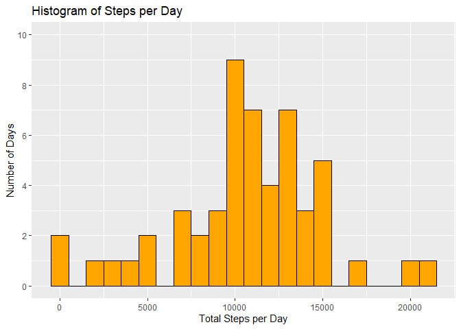
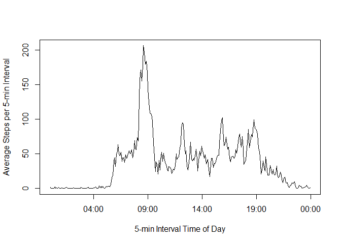
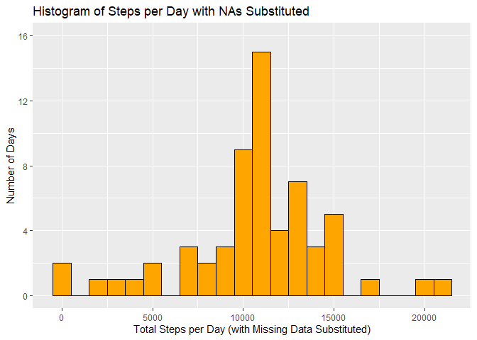
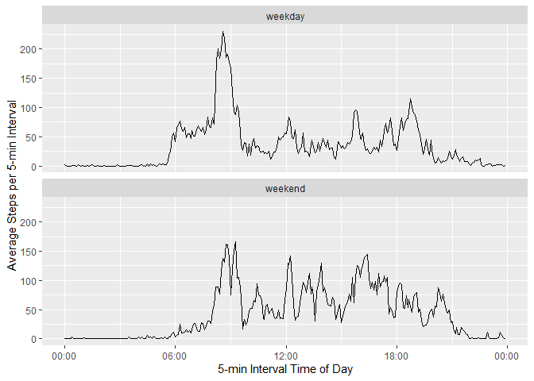

*Brian Hampton*

*July 2021*

## Loading and preprocessing the data
Load the necessary r packages:

```r
knitr::opts_chunk$set(echo = TRUE)
library(tidyverse)
```

```
## -- Attaching packages --------------------------------------- tidyverse 1.3.0 --
```

```
## v ggplot2 3.3.3     v purrr   0.3.4
## v tibble  3.1.0     v dplyr   1.0.5
## v tidyr   1.1.3     v stringr 1.4.0
## v readr   1.4.0     v forcats 0.5.1
```

```
## -- Conflicts ------------------------------------------ tidyverse_conflicts() --
## x dplyr::filter() masks stats::filter()
## x dplyr::lag()    masks stats::lag()
```

```r
library(lubridate)
```

```
## 
## Attaching package: 'lubridate'
```

```
## The following objects are masked from 'package:base':
## 
##     date, intersect, setdiff, union
```

```r
library(ggplot2)
```

From the working directory, save the data into r:

```r
data <- read.csv("activity.csv")
```
Create a "time" variable from the "interval" integers.  This is to avoid data
gaps when plotting the interval on the x-axis (no data between 60 & 100 for
each hour):

```r
t1 <- subset(data, interval < 60)
t1$time <- sprintf("00:%02d", t1$interval)
t2 <- subset(data, interval > 99)
t2$hour <- floor(t2$interval / 100)
t2$minute <- t2$interval - t2$hour * 100
t2$time <- sprintf("%02d:%02d", t2$hour, t2$minute)
t3 <- t2[, c(1:3, 6)]
df <- rbind(t1, t3)
```
## What is mean total number of steps taken per day?

### 1. Make a histogram of the total number of steps taken each day.

Determine the total steps taken each day:

```r
Total_Steps_per_Day <- df %>%
        filter(!is.na(steps)) %>%
        group_by(date) %>%
        summarize(Total_Steps = sum(steps)) %>%
        print
```

```
## # A tibble: 53 x 2
##    date       Total_Steps
##    <chr>            <int>
##  1 2012-10-02         126
##  2 2012-10-03       11352
##  3 2012-10-04       12116
##  4 2012-10-05       13294
##  5 2012-10-06       15420
##  6 2012-10-07       11015
##  7 2012-10-09       12811
##  8 2012-10-10        9900
##  9 2012-10-11       10304
## 10 2012-10-12       17382
## # ... with 43 more rows
```
Create a histogram from the results in the previous step:

```r
ggplot(Total_Steps_per_Day, aes(x = Total_Steps)) + 
        geom_histogram(binwidth = 1000, color = "black", fill = "orange") +
        scale_y_continuous(name = "Number of Days", breaks = seq(0, 10, 2), 
                  limits = c(0, 10)) +
        labs(title = "Histogram of Steps per Day", 
             x = "Total Steps per Day")
```

<!-- -->

### 2. Calculate and report the **mean** and **median** steps taken per day:

```r
Mean_Steps <- format(mean(Total_Steps_per_Day$Total_Steps, na.rm = TRUE),
                     big.mark = ",", scientific = FALSE) 
                   
Median_Steps <- format(median(Total_Steps_per_Day$Total_Steps, na.rm = TRUE),
                     big.mark = ",", scientific = FALSE)   
```
The mean is **10,766.19** steps taken per day.
The median is **10,765** steps taken per day.

## What is the agerage daily activity pattern?
### 1. Make a time series plot of the 5-minute interval and the average number of 
### steps taken, averaged across all days:


```r
Average_Steps_Interval <- df %>%
        filter(!is.na(steps)) %>%
        group_by(time) %>%
        summarize(Average_Steps = mean(steps)) %>%
        print
```

```
## # A tibble: 288 x 2
##    time  Average_Steps
##    <chr>         <dbl>
##  1 00:00        1.72  
##  2 00:05        0.340 
##  3 00:10        0.132 
##  4 00:15        0.151 
##  5 00:20        0.0755
##  6 00:25        2.09  
##  7 00:30        0.528 
##  8 00:35        0.868 
##  9 00:40        0     
## 10 00:45        1.47  
## # ... with 278 more rows
```

```r
with(data = Average_Steps_Interval,
     expr = 
       {time = as.POSIXct(x = time,
                          format = "%H:%M")
       plot(x = time,
            y = Average_Steps,
            type = "l",
            xlab = "5-min Interval Time of Day",
            ylab = "Average Steps per 5-min Interval")
       })
```

<!-- -->

### 2. Which 5-minute interval, on average across all the days in the dataset, 
### contains the maximum number of steps?

```r
Average_Steps_Interval %>% slice_max(Average_Steps)
```

```
## # A tibble: 1 x 2
##   time  Average_Steps
##   <chr>         <dbl>
## 1 08:35          206.
```
## Imputing missing values
### 1. Caclulate and report the total number of missing values in the dataset

```r
Rows_with_NAs <- format(nrow(subset(df, is.na(df$steps))),big.mark = ",", scientific = FALSE) 
```
There are **2,304** missing values in the dataset.

### 2. Devis a strategy for filling in all of the missing values in the dataset.
To replace the missing values with their respective average steps per interval, subset the missing values from the working dataframe, and merge it with the average
steps per interval:

```r
df_of_NAs <- subset(df, is.na(df$steps))
df_sub_NAs  <- df_of_NAs[, 2:4]
Sub_Values <- merge(df_sub_NAs, Average_Steps_Interval)
colnames(Sub_Values)[4] <- "steps"
Sub_Values <- Sub_Values[, c(4, 2, 3, 1)]
```
### 3. Create a new dataset that is equal to the original dataset but with the missing data filled in.
Subset the complete cases (observations with no missing values) from the working
dataframe:

```r
df_no_NAs <- df[complete.cases(df),]
```
Combine the substituted interval values with the complete cases dataframe:

```r
df_with_Subs <- rbind(Sub_Values, df_no_NAs)
head(df_with_Subs)
```

```
##      steps       date interval  time
## 1 1.716981 2012-10-01        0 00:00
## 2 1.716981 2012-11-14        0 00:00
## 3 1.716981 2012-11-10        0 00:00
## 4 1.716981 2012-11-30        0 00:00
## 5 1.716981 2012-11-04        0 00:00
## 6 1.716981 2012-11-01        0 00:00
```
### 4. Make a histogram of the new dataset with the substituted values, report the **mean** and **median** total number of steps taken per day.
Calculate the total daily steps with the substituted values:

```r
Total_Steps_with_Subs <- df_with_Subs %>%
  group_by(date) %>%
  summarize(Total_Steps = sum(steps))%>%
  print
```

```
## # A tibble: 61 x 2
##    date       Total_Steps
##    <chr>            <dbl>
##  1 2012-10-01      10766.
##  2 2012-10-02        126 
##  3 2012-10-03      11352 
##  4 2012-10-04      12116 
##  5 2012-10-05      13294 
##  6 2012-10-06      15420 
##  7 2012-10-07      11015 
##  8 2012-10-08      10766.
##  9 2012-10-09      12811 
## 10 2012-10-10       9900 
## # ... with 51 more rows
```
Generate a histogram with the substituted values:

```r
ggplot(Total_Steps_with_Subs, aes(x = Total_Steps)) + 
  geom_histogram(binwidth = 1000, color = "black", fill = "orange") +
  scale_y_continuous(name = "Number of Days", breaks = seq(0, 16, 4), 
                     limits = c(0, 16)) +
  labs(title = "Histogram of Steps per Day with NAs Substituted", 
       x = "Total Steps per Day (with Missing Data Substituted)")
```

<!-- -->

```r
Mean_Steps_Subs <- format(mean(Total_Steps_with_Subs$Total_Steps),
                  big.mark = ",", scientific = FALSE) 
Median_Steps_Subs <- format(median(Total_Steps_with_Subs$Total_Steps),
                  big.mark = ",", scientific = FALSE) 
```
The mean, with substituted values, is **10,766.19** steps taken per day.
The median, with substituted values, is **10,766.19** steps taken per day.

Replacing the missing values with the average steps per their respective time intervals does not change the daily mean or median but does increase the reported total steps taken over the data collection period.  The inclusion of the substituted values changes the distribution of the total steps per day as seen in the histogram.

## Are there diffferences in activity patterns between weekdays and weekends?

### 1. Create a new factor variable in the dataset with two levels

```r
df_with_Subs$TypeDay <- ifelse(weekdays(as.Date(df_with_Subs$date)) == "Saturday" |
                             weekdays(as.Date(df_with_Subs$date)) == "Sunday",
                                              "weekend", "weekday")

Steps_TypeDay <- aggregate(steps ~ time + TypeDay, data = df_with_Subs, FUN = mean)
names(Steps_TypeDay) <- c("time", "TypeDay", "mean_steps")
head(Steps_TypeDay)
```

```
##    time TypeDay mean_steps
## 1 00:00 weekday 2.25115304
## 2 00:05 weekday 0.44528302
## 3 00:10 weekday 0.17316562
## 4 00:15 weekday 0.19790356
## 5 00:20 weekday 0.09895178
## 6 00:25 weekday 1.59035639
```
Using ggplot for a line plot with time as the x-axis, mutate the time variable so that the output is as expected:

```r
Steps_TypeDay %>%
  mutate(time = as.POSIXct(hms::parse_hm(time))) %>%
  ggplot(aes(time, mean_steps)) +
  geom_line() + facet_grid(.~TypeDay) +
  scale_x_datetime(date_labels = "%H:%M") +
  facet_wrap(~TypeDay, ncol = 1) +
  labs(x = "5-min Interval Time of Day", y = "Average Steps per 5-min Interval")
```

<!-- -->

The plots indicate that the test subjects were more active (step-wise) early in the day on weekdays (perhaps while going to work or school), while on weekends their overall steps per 5-minute interval was more evenly distributed throughout the day. 
                
